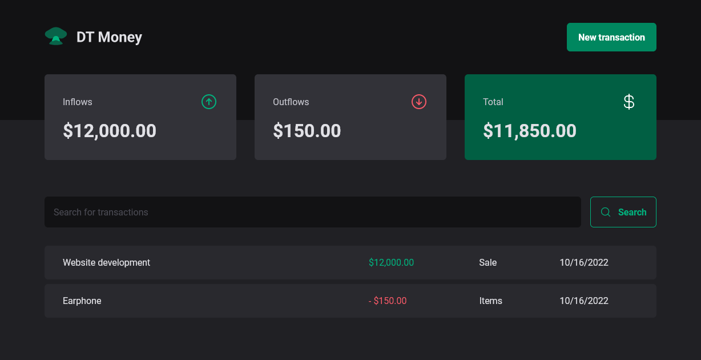

<h1 align="center">DT Money</h1>
<p align="center">Application to manage personal finances!</p>

<h3 align="center">

  <a href="./LICENSE" target="_blank">
    
  </a>

</h3>

<br />

<p align="center">
    
</p>

<br />

# Techs

-  Vite
-  Axios
-  React
-  Typescript
-  Phosphor React
-  Styled Components


## Installation of dependencies and local use

> Create somewhere on your pc, a folder to create a copy of the repository, inside it open command terminal and type the commands below:
```
git clone https://github.com/AlanWehrliLC/dt-money.git
cd dt-money
npm install
npm run dev
```

> With another command terminal open use the command below to activate the "false server", which uses the json-server:
```
npm run dev:server
```

